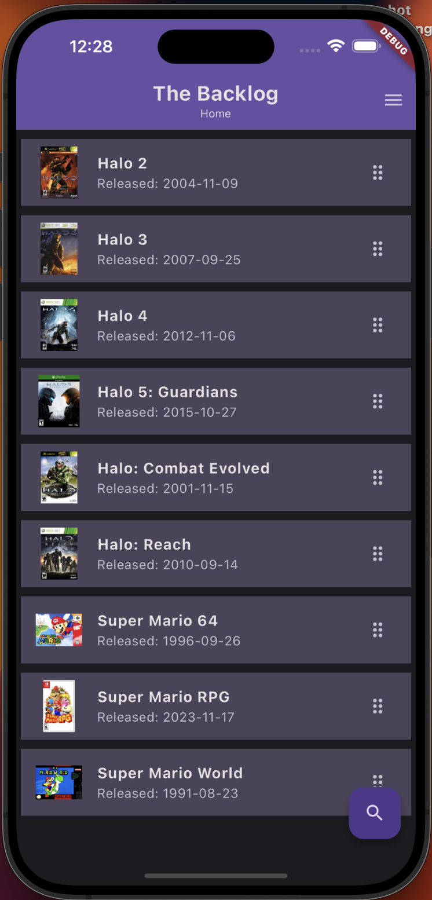
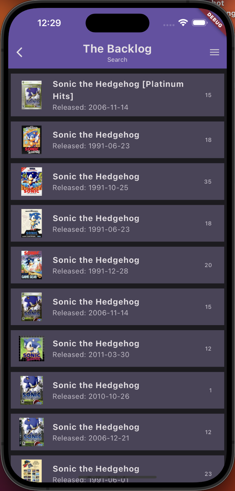

# The Backlog

A mobile app built with Flutter to track video games that you would like to play or complete.

\*\* Special Thanks to the good folks over at TheGamesDB
[https://thegamesdb.net](https://thegamesdb.net)

## Cloning & Forking

For this app to operate properly, you will need to acquire your own API Key from The Games DB.

The API Key should be placed in a .env file located in the top level of your app, with the following entry:

GAMES_DB_API_KEY = 'Your Games DB Key Here'

